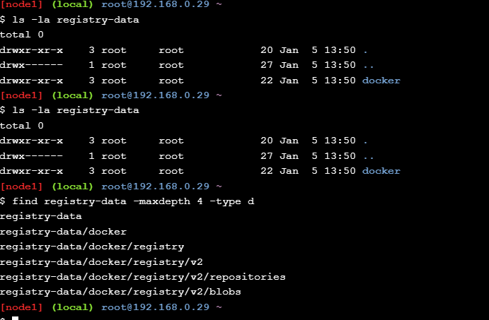

На последнем шаге лабораторной работы Docker Registry был запущен с подключённым внешним хранилищем (registry-data), смонтированным в /var/lib/registry.
После публикации образа hello-world в registry, в каталоге registry-data была сформирована стандартная структура Docker Registry v2 (docker/registry/v2/repositories, blobs), что подтверждает успешное сохранение образа вне контейнера registry.
