## Docker Registry — External Storage


На последнем шаге лабораторной работы Docker Registry был запущен с подключённым внешним хранилищем (registry-data), смонтированным в `/var/lib/registry`.

После публикации образа hello-world в registry, в каталоге registry-data была сформирована стандартная структура Docker Registry v2 (docker/registry/v2/repositories, blobs), что подтверждает успешное сохранение образа вне контейнера registry.

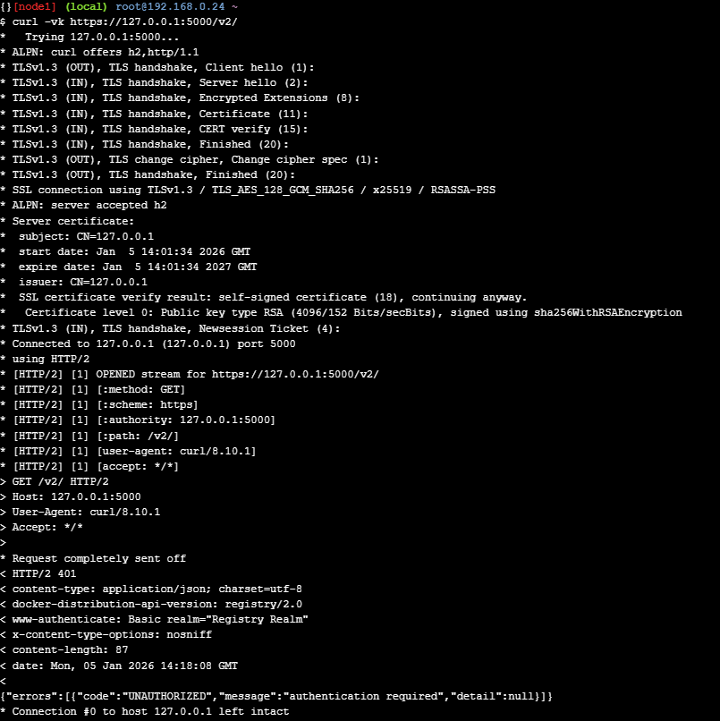
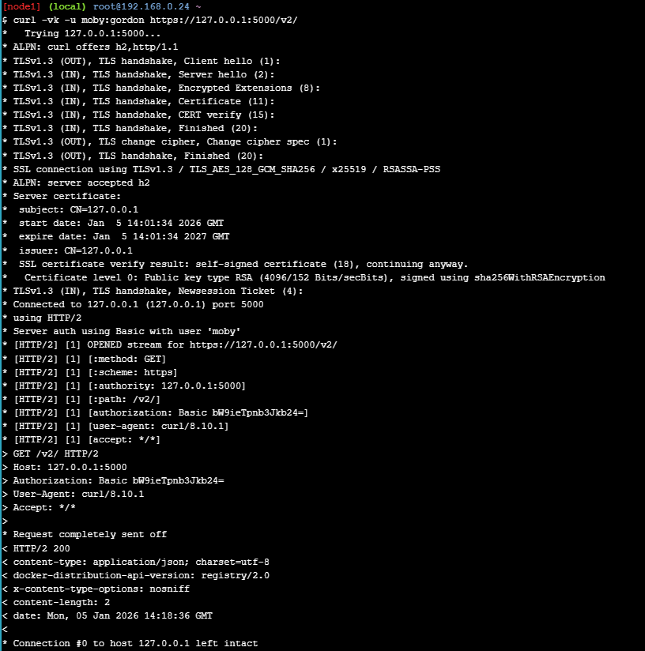
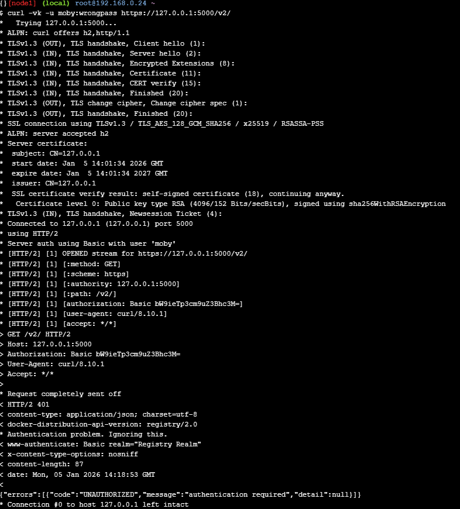

---

## Docker Registry — HTTPS и аутентификация

Registry настроен на работу по протоколу HTTPS с использованием TLS-сертификата. Наличие HTTPS подтверждено выводом curl -vk (TLS handshake). Для доступа включена Basic Authentication через htpasswd. Без учётных данных сервер возвращает 401 Unauthorized. При передаче корректных учётных данных moby:gordon запрос к /v2/ завершается успешно с кодом 200 OK, что подтверждает успешную аутентификацию.


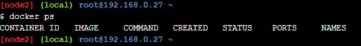
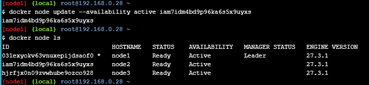
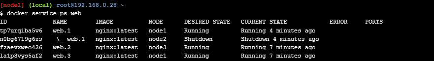
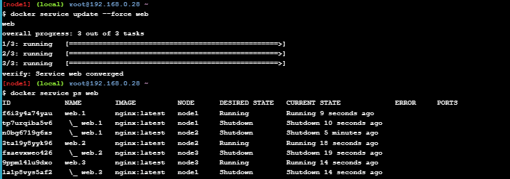

---

## Docker Swarm — управление состоянием узлов

### Вопрос 1: восстановилась ли работа запущенного сервиса на этом узле?

После перевода узла в Drain задачи сервиса были перенесены на другие узлы. После возврата узла в Active сервис продолжил работать, но задачи не обязаны автоматически возвращаться на этот узел.

### Вопрос 2: что необходимо сделать, чтобы запустить работу службы на этом узле снова?

Нужно инициировать перепланирование задач, например выполнить:

```bash
docker service update --force <service>

---

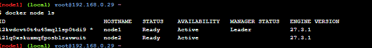
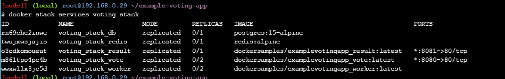
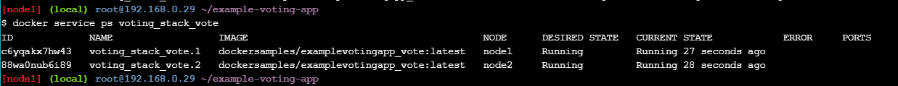
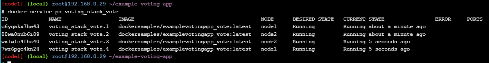
Как конфигурируется количество нодов в стэке
Количество нод не задаётся в файле стэка: оно определяется составом Swarm-кластера (команда docker node ls). В docker-stack.yml задаётся количество экземпляров сервисов через параметр deploy.replicas, а планировщик Docker Swarm распределяет реплики по доступным нодам автоматически.
Как организуется проверка жизнеспособности сервисов
Жизнеспособность обеспечивается механизмами Docker Swarm: сервис состоит из задач (tasks), и Swarm поддерживает требуемое число задач в состоянии Running. При сбое контейнера задача пересоздаётся согласно политикам в секции deploy (например restart_policy, update_config, если заданы). Дополнительно может использоваться healthcheck в compose/stack файле для определения состояния контейнера.
 
1. Кластеризованный вариант развертывания приложения

На основе репозитория со счётчиком реализован кластеризованный вариант развертывания приложения с использованием Docker Swarm.

Для развертывания используется файл docker-compose.swarm.yml и команда:

docker stack deploy -c docker-compose.swarm.yml counter

Масштабирование Flask-приложения

Количество инстансов контейнера, в котором работает Flask, явно задано и равно 4:

deploy:
  replicas: 4


Docker Swarm поддерживает декларативную модель состояния, поэтому оркестратор постоянно поддерживает наличие ровно четырёх реплик сервиса. В случае сбоя контейнер автоматически перезапускается (self-healing).

2. Подтверждение изменения потенциала обработки запросов (нагрузочное тестирование)

Для проверки изменения потенциала обработки запросов использовалось нагрузочное тестирование с помощью инструмента Locust (locustfile.py).

Тестируемые эндпоинты

GET /api/counter

POST /api/counter/increment

POST /api/counter/decrement

POST /api/counter/reset

Сравниваемые режимы

Одиночный запуск (docker-compose.yml)

1 инстанс Flask

1 инстанс Redis

Кластеризованный запуск (Swarm) (docker-compose.swarm.yml)

4 инстанса Flask

Redis с репликацией

Результаты (обобщённо)
Режим	Инстансы Flask	Потенциал обработки запросов
Одиночный запуск	1	Базовый
Docker Swarm	4	Выше / не линейно выше
Вывод

Потенциал обработки запросов изменился, так как:

web-приложение является stateless и эффективно масштабируется горизонтально;

нагрузка распределяется между 4 репликами через встроенный ingress-балансировщик Swarm.

При этом рост не является строго линейным из-за ограничений со стороны базы данных (stateful-компонент).

3. Увеличение количества инстансов сервера с БД

В качестве сервера БД используется Redis.

В кластеризованной конфигурации количество инстансов Redis увеличено до трёх:

1 master (redis-master);

2 replica (redis-replica-1, redis-replica-2).

Таким образом, требование «увеличить количество инстансов сервера с БД» выполнено.

4. Особенности работы реплицированного сервиса с БД

При работе с реплицированной базой данных существуют следующие особенности:

Запись выполняется только в master
Реплики Redis по умолчанию read-only, поэтому write-нагрузка не масштабируется.

Replication lag
Репликация асинхронная, возможна задержка между master и репликами, что приводит к eventual consistency.

Отсутствие автоматического failover
Без Redis Sentinel или Redis Cluster реплики не становятся master автоматически при отказе.

Пути решения

разделение потоков чтения и записи (read/write splitting);

использование Redis Sentinel для failover;

использование Redis Cluster для масштабирования записи.

В текущей реализации репликация повышает надёжность, но не увеличивает производительность базы данных.

5. Особенности depends_on в Docker Swarm

В Docker Swarm директива depends_on не обеспечивает порядок запуска и готовность сервисов. Все сервисы запускаются параллельно.

Корректная работа приложения обеспечивается за счёт:

retry-логики подключения к Redis в коде приложения;

политики перезапуска (restart_policy) в Docker Swarm.

6. Использование Kubernetes (k3s) вместо Docker Swarm

Альтернативный вариант кластеризации реализован с использованием Kubernetes (k3s) и приведён в файле k8s-deployment.yaml.

Отличия от Docker Swarm

масштабирование осуществляется через Deployment (replicas: 4);

балансировка нагрузки реализуется через Service;

stateful-сервисы требуют использования StatefulSet и PersistentVolume.

Kubernetes предоставляет более гибкие и развитые механизмы управления состоянием, однако Docker Swarm проще в настройке и эксплуатации.
В ходе выполнения работы были последовательно изучены и практически отработаны основные механизмы работы Docker Swarm и средств контейнерной оркестрации.

Были выполнены задания по развертыванию собственного Docker Registry с использованием внешнего хранилища, а также настроена аутентификация и защищённое подключение к registry по протоколу HTTPS. Продемонстрированы как успешные, так и неуспешные попытки аутентификации, что подтвердило корректность настройки механизма безопасности.

В рамках изучения оркестрации Docker Swarm были исследованы режимы работы узлов кластера (Active и Drain). Установлено, что при переводе узла в состояние Drain запущенные на нём сервисы автоматически перераспределяются на другие активные узлы. После возврата узла в состояние Active сервисы на нём не восстанавливаются автоматически — для их повторного запуска требуется пересоздание или обновление сервиса, что подчёркивает декларативную модель управления состоянием в Swarm.

Также был изучен механизм развертывания стеков в Docker Swarm. Зафиксировано, что количество инстансов сервисов в стеке конфигурируется через параметр deploy.replicas, а контроль жизнеспособности сервисов обеспечивается с помощью restart_policy и healthcheck, позволяющих реализовать автоматическое восстановление контейнеров.

На основе репозитория со счётчиком реализован кластеризованный вариант развертывания приложения, в котором количество инстансов Flask-приложения было увеличено до четырёх. Проведено нагрузочное тестирование с использованием Locust, которое показало, что потенциал обработки запросов изменяется при горизонтальном масштабировании stateless-приложения. При этом рост производительности не является строго линейным из-за ограничений со стороны stateful-компонента.

Количество инстансов сервера базы данных было увеличено за счёт репликации Redis (master + replicas). Выявлены особенности работы реплицированного сервиса БД: невозможность масштабирования операций записи, наличие replication lag и отсутствие автоматического failover без дополнительных компонентов. Определены возможные пути решения данных ограничений, включая использование Sentinel, Redis Cluster и разделение потоков чтения и записи.

Дополнительно был исследован альтернативный подход к кластеризации с использованием Kubernetes (k3s). Установлено, что Kubernetes предоставляет более развитые механизмы управления состоянием, масштабирования и отказоустойчивости, однако требует более сложной конфигурации по сравнению с Docker Swarm.
